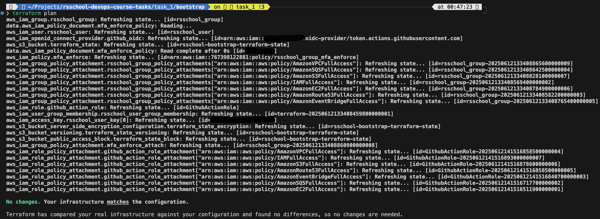
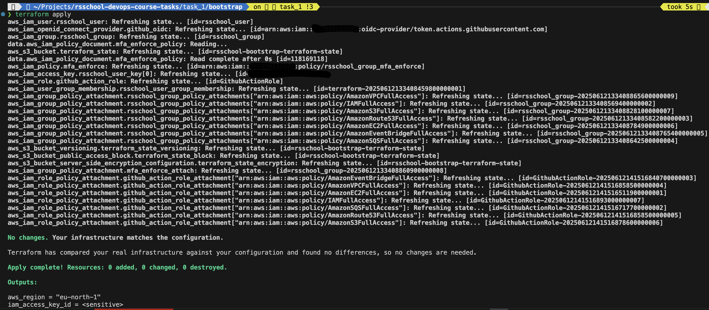
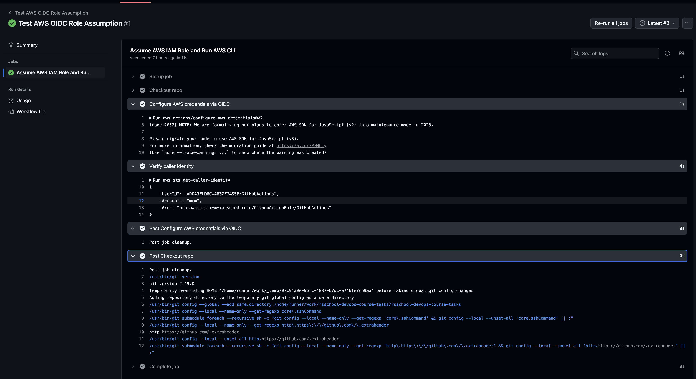
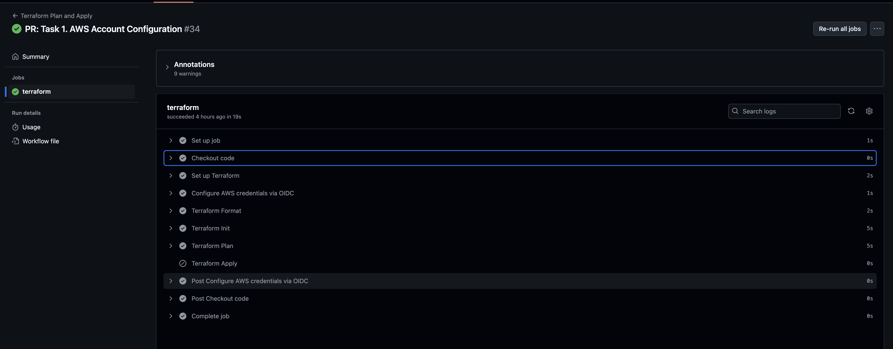
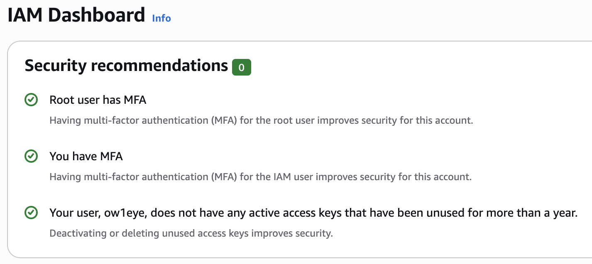
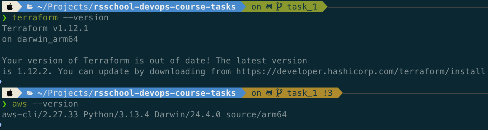

# Tasks 1: AWS Account Configuration

## Overview

This repository contains a structured set of tasks and infrastructure code developed as part of the RS School DevOps Course.

## Structure

The project is organized into multiple task directories. Each task may contain Terraform configurations, scripts, and supporting documentation.

### High-Level Directory Tree

```
/.github/workflows/terraform.yml
/.github/workflows/test-aws-role.yml
/.pre-commit-config.yaml
/README.md
/task_1/bootstrap/iam.tf
/task_1/bootstrap/main.tf
/task_1/bootstrap/outputs.tf
/task_1/bootstrap/providers.tf
/task_1/bootstrap/s3.tf
/task_1/bootstrap/save-iam-credentials.sh
/task_1/bootstrap/variables.tf
/task_1/project/iam.tf
/task_1/project/main.tf
/task_1/project/outputs.tf
/task_1/project/providers.tf
/task_1/project/variables.tf
```

This task consists of two parts:

- **Bootstrap**
- **Project**

It\`s two different Terraform configuration that needed to do next thing:

### Bootstrap

This part of Terraform code with Shell script and Make file will help to initialize basic AWS infrastructure setup to deploy
via Github Actions.

Terraform code will bootstrap this AWS services:

- IAM for separated account and permission (policy) management.
- S3 to store Terraform state files.

**Usage**

1. At the beggining you need to adjust some variables that based on provided example files.

<details>

```terraform
# AWS Region
aws_region = "" # Set your actual AWS region
aws_profile = "" # Set specific AWS profile. Dont change if you are using default one.

# IAM User and Group
user_name  = "" # AWS IAM account user name that will be created to manage our terraform Project part.
group_name = "" # AWS IAM group name that our user above will part of to inherit policy permissions.

# Whether to create an access key for the IAM user
create_access_key = true # Option to allow creation of AWS IAM account key pair for our user.

# S3 Bucket for Terraform state
bucket_name = "rsschool-bootstrap-terraform-state" # Specify AWS S3 Bucket name that you want to create.

# Environment name for tagging
environment = "" # Can be set to `dev` , `prod`, or anothing else.

# AWS Managed Policies to Attach
# List of policies that will be applied to our AWS IAM group and role.
managed_policy_arns = [
  "arn:aws:iam::aws:policy/AmazonEC2FullAccess",
  "arn:aws:iam::aws:policy/AmazonRoute53FullAccess",
  "arn:aws:iam::aws:policy/AmazonS3FullAccess",
  "arn:aws:iam::aws:policy/IAMFullAccess",
  "arn:aws:iam::aws:policy/AmazonVPCFullAccess",
  "arn:aws:iam::aws:policy/AmazonSQSFullAccess",
  "arn:aws:iam::aws:policy/AmazonEventBridgeFullAccess"
]

github_repo    = ""  # Format: owner/repo . Your personal Github account and project
```

</details>

2. Initialize terraform by running

```bash
terraform init
```

3. Create terraform plan configuration

```bash
terraform plan
```

<details>



</details>

4. Apply planned terraform configuration

```bash
terraform apply -auto-approve
```

<details>



</details>

5. At this point you need to uncomment section `terraform` under `main.tf` file to be able to migrate terraform state from local to newly created AWS S3 Bucket that will store it.

1. Migrate terraform state

```bash
terraform init -migrate-state
```

Dont forget to approve migration by typing "yes" when console will ask you.

7. Run `save-iam-credential.sh` shell script to retrive and save newly create AWS IAM user credentials and configs into shared file that locates under `~/.aws/` path. You need to set your actual profile name in the bottom of the script body here:

```bash
export AWS_PROFILE=your_aws_profile_name
```

By making all this steps you will be earn:

- AWS IAM user for managing AWS by terraform CLI in future.
- AWS IAM group with set of policy permissions.
- AWS IAM role for Github Actions pipeline usage.
- AWS S3 Bucket with versioning, encryption and etc. to store terraform state files.
- Configured AWS CLI credentials and configuration to run next part from.

### Project

This part of Terraform code will be used by Github Actions to deploy our future AWS infrastructure in IaaC way.

**Usage**

This code will be used only by Github Actions pipeline but can be tested localy. It will created a test AWS IAM user with access key pair.

Terraform state for this part will be automaticaly stored in AWS S3 Bucket created in **Bootstrap** section.

## Github Actions configuration

There are two Github Actions workflow files:

- `test-aws-role.yml`
- `terraform,yml`

### Test AWS role

This workflow can be run only manual to test if AWS IAM Github OIDC provider and role can be assumed properly.
`AWS_ACCOUNT_ID`, `role` and `AWS region` must be set by your actual data.

<details>

```yaml
name: Test AWS OIDC Role Assumption

on:
  workflow_dispatch:

permissions:
  id-token: write  # Required for OIDC token exchange
  contents: read   # Required to checkout the repo

jobs:
  assume-role-and-test:
    name: Assume AWS IAM Role and Run AWS CLI
    runs-on: ubuntu-latest

    steps:
      - name: Checkout repo
        uses: actions/checkout@v4

      - name: Configure AWS credentials via OIDC
        uses: aws-actions/configure-aws-credentials@v2
        with:
          role-to-assume: arn:aws:iam::${{ secrets.AWS_ACCOUNT_ID }}:role/GithubActionRole # AWS Account ID should be set in GitHub Secrets. Role must trust GitHub OIDC.
          aws-region: eu-north-1 # Specify your AWS region

      - name: Verify caller identity
        run: aws sts get-caller-identity

```



</details>

### Terraform workflow

This workflow will run automaticaly when one of two triggers:

- create PR request from feature-branch to main.
- push to main branch.

<details>

```yaml
name: Terraform Plan and Apply

on:
  push:
    branches:
      - main
  pull_request:
    branches:
      - main

permissions:
  id-token: write  # Required for OIDC token exchange
  contents: read   # Required to checkout the repo

jobs:
  terraform:
    runs-on: ubuntu-latest

    steps:

      - name: Checkout code
        uses: actions/checkout@v3

      - name: Set up Terraform
        uses: hashicorp/setup-terraform@v1
        with:
          terraform_version: 1.12.0

      - name: Configure AWS credentials via OIDC
        uses: aws-actions/configure-aws-credentials@v4
        with:
          role-to-assume: arn:aws:iam::${{ secrets.AWS_ACCOUNT_ID }}:role/GithubActionRole # AWS Account ID should be set in GitHub Secrets
          aws-region: eu-north-1

      - name: Terraform Format
        run: terraform fmt -check -recursive

      - name: Terraform Init
        run: terraform init
        working-directory: task_1/project

      - name: Terraform Plan
        run: terraform plan -out=output.tfplan -var="aws_region=${{ secrets.AWS_REGION }}" -var="aws_account_id=${{ secrets.AWS_ACCOUNT_ID }}" -var="user_name=${{ secrets.USER_NAME }}" -var="create_access_key=true"
        working-directory: task_1/project

      - name: Terraform Apply
        if: github.event_name == 'push'
        run: terraform apply -auto-approve output.tfplan
        working-directory: task_1/project

```



</details>

In the "PR request" creation scenario pipeline workflow will setup Terraform, checkout Github repository, run `terraform fmt/init/plan` in order.

In the "push to main branch" scenario to all previous steps will be added `terraform apply` to deploy planned Terraform code into your AWS account.

## Additional info:

<details>





</details>

## Notes

- All commit ws running with linters
- Fixed almost all security issue provided by Trivy for Terraform code. Ignored two CVE that doesnt affect our configuration at this time. This part of code commented in the `s3.tf` file.
- Make files provides better usage of commands and resources management in the local usage case.
