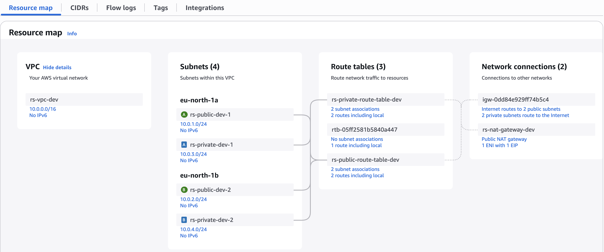
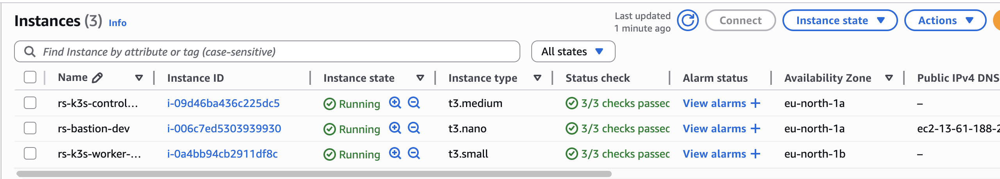
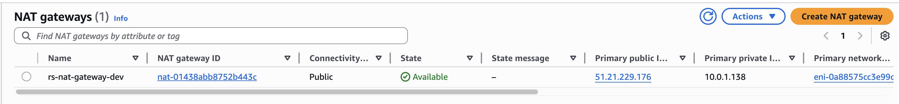

# Tasks 3: K8s Cluster Configuration and Creation

[](https://github.com/isbelevtsov/rsschool-devops-course-tasks/actions/workflows/terraform.yml)

## Overview

## Table of Contents

- [Before you start](#before-you-start)
- [Prerequisites](#prerequisites)
- [Features](#features)
- [Directory Structure](#directory-structure)
- [GitHub Actions Workflow](#github-actions-workflow)
- [Required GitHub Secrets](#required-github-secrets)
- [Security Best Practices Implemented](#security-best-practices-implemented)
- [Terraform Version](#terraform-version)
- [Notes](#notes)
- [Usability confirmation](#usability-confirmation)

## Before you start

Note that this task can uses AWS resources that are outside the AWS free tier, so be careful!

## Prerequisites

- [Terraform](https://www.terraform.io/) - Terraform is an open-source infrastructure as code software tool that provides a consistent CLI workflow to manage hundreds of cloud services. Terraform codifies cloud APIs into declarative configuration files.
- [Amazon AWS Account](https://aws.amazon.com/it/console/) - Amazon AWS account.
- [AWS CLI](https://aws.amazon.com/cli/) - Amazon AWS CLI.
- Task 1 bootstrap Terraform code must be executed before running this task.
- Github Action Secrets must be already initialized throught the Github web console.
- Set variables according to your desire.

## Features

- VPC creation with CIDR block `10.0.0.0/16`
- 2 Public subnets in separate Availability Zones
- 2 Private subnets in separate Availability Zones
- Internet Gateway for public subnet access
- NAT Gateway for private subnet internet access
- Route tables for intra-VPC and external access
- Bastion EC2 instance in the public subnet with predefined SSH key and custom instance profile with SSM access
- Private EC2 instances in private subnets and bootstraped K3S cluster with two nodes: 1 control plane and 1 worker
- Security Groups with descriptions and rule auditing
- Network Access Lists for better subnet traffic control
- CloudWatch log group for VPC flow logs
- Tags including GitHub Actions metadata
- GitHub Actions pipeline for Terraform Plan, Apply & Destroy using OIDC

## Directory Structure

```
.
├── .github
│   ├── actions
│   │   └── action.yml.off                   # Github Actions workflow separate action that can be reused in the pipeline
│   └── workflows
│       └── terraform.yml                    # Github Actions workflow pipeline configuration
├── task_3
│   ├── project
│   │    ├── .env.example                    # Example file contains variables for Makefile
│   │    ├── ami.tf                          # AWS AMI configuration for future EC2 instaces deployment
│   │    ├── backend.tf                      # Terraform backend condiguration
│   │    ├── ec2.tf                          # AWS EC2 instances configuration
│   │    ├── iam.tf                          # AWS IAM configuration
│   │    ├── logs.tf                         # AWS S3 bucket logging for security purpose and KMS key configuration for data encryption
│   │    ├── Makefile                        # Makefile for better project and data magement
│   │    ├── networking.tf                   # AWS subnets and routing configuration alongside with network access lists configuration
│   │    ├── outputs.tf                      # Terraform outputs data
│   │    ├── providers.tf                    # Terraform providers configuration
│   │    ├── sg.tf                           # AWS security groups configuration for network traffic control
│   │    ├── terraform.auto.tfvars.example   # Example file contains test variables or placeholders for Terraform (only for
│   │    │                                   # local usage, Github Actions workflow will generate it in process)
│   │    ├── user_data.tpl                   # User data script template for AWS bastion EC2 instance
│   │    ├── variables.tf                    # Terraform variables configuration
│   │    └── vpc.tf                          # AWS VPC configuration
│   ├── screenshots                          # Screenshots location that mentioned in PR
│   │    └── ...
│   └── README.md                            # This file
```

## GitHub Actions Workflow

The `terraform.yml` workflow performs:

- Code checkout
- Terraform setup
- AWS credentials via OIDC
- `terraform fmt`, `init`, `plan`, `apply`, `destroy`
- PR comment with `terraform plan` output

## Required GitHub Secrets

| Secret Name              | Description                        |
| ------------------------ | ---------------------------------- |
| `ALLOWED_SSH_CIDR`       | CIDR block for SSH access          |
| `AWS_ACCOUNT_ID`         | AWS account ID                     |
| `AWS_REGION`             | AWS region                         |
| `AZS`                    | Comma-separated AZ list            |
| `CERT_PATH`              | SSH key file full path             |
| `GH_TOKEN`               | Github token for commenting PR     |
| `KEY_PAIR`               | EC2 key pair name                  |
| `PARAM_NAME`             | SSM Parameter Store key path       |
| `PRIVATE_SUBNET_CIDRS`   | Comma-separated CIDRs for private  |
| `PUBLIC_SUBNET_CIDRS`    | Comma-separated CIDRs for public   |
| `TF_VERSION`             | Terraform version                  |
| `VPC_CIDR`               | VPC CIDR block                     |

## Security Best Practices Implemented

- IMDSv2 enforcement for EC2 (AVD-AWS-0028)
- Encrypted root EBS volumes (AVD-AWS-0131)
- Security group and rule descriptions (AVD-AWS-0099, AVD-AWS-0124)
- VPC Flow Logs enabled (AVD-AWS-0178)
- CloudWatch Log Group encryption awareness (AVD-AWS-0017)

## Terraform Version

Tested with Terraform `1.12.0`

## Notes

- All tagging includes `Task`, `ManagedBy`, `CI`, and `Date` fields.
- `output.tfplan` is commented on PRs automaticaly.
- All resources can be destroyed using the same way as `Plan` or `Apply`.

## Usability confirmation

<details><summary>Resources creation and usage proofs</summary>

### AWS VPC Resource map<br>

<br>

### AWS EC2 instances<br>

<br>

### NAT gateway for private network<br>

<br>

</details>
