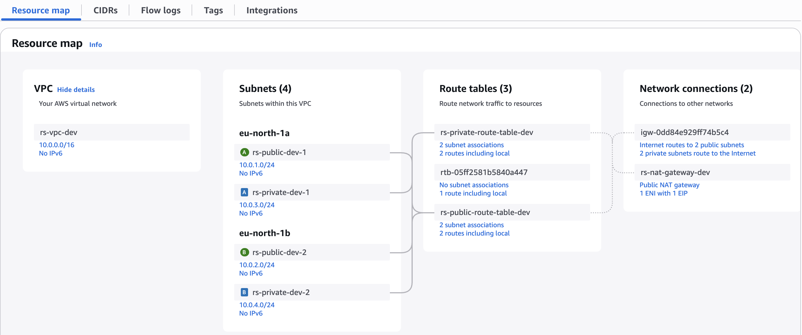
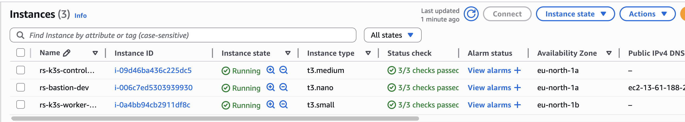
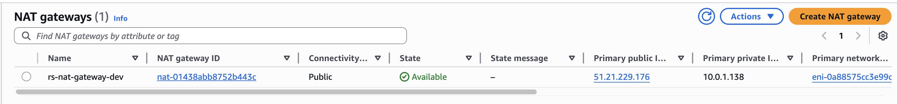
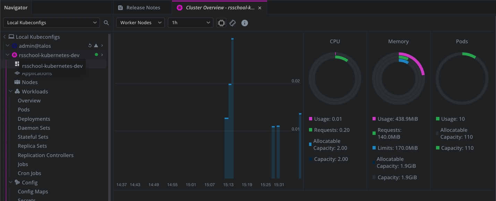
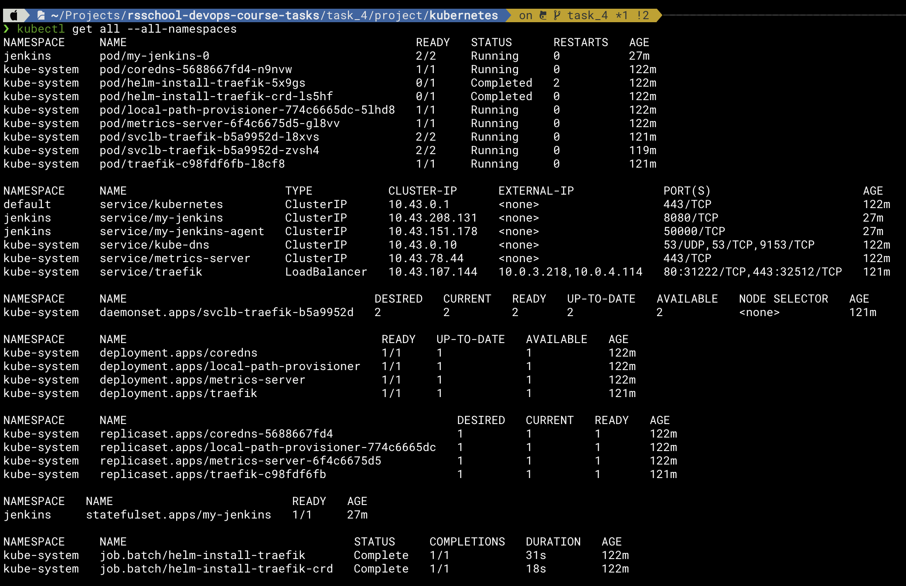
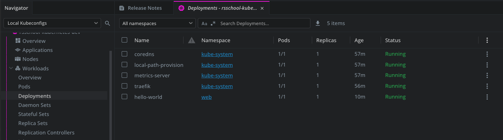
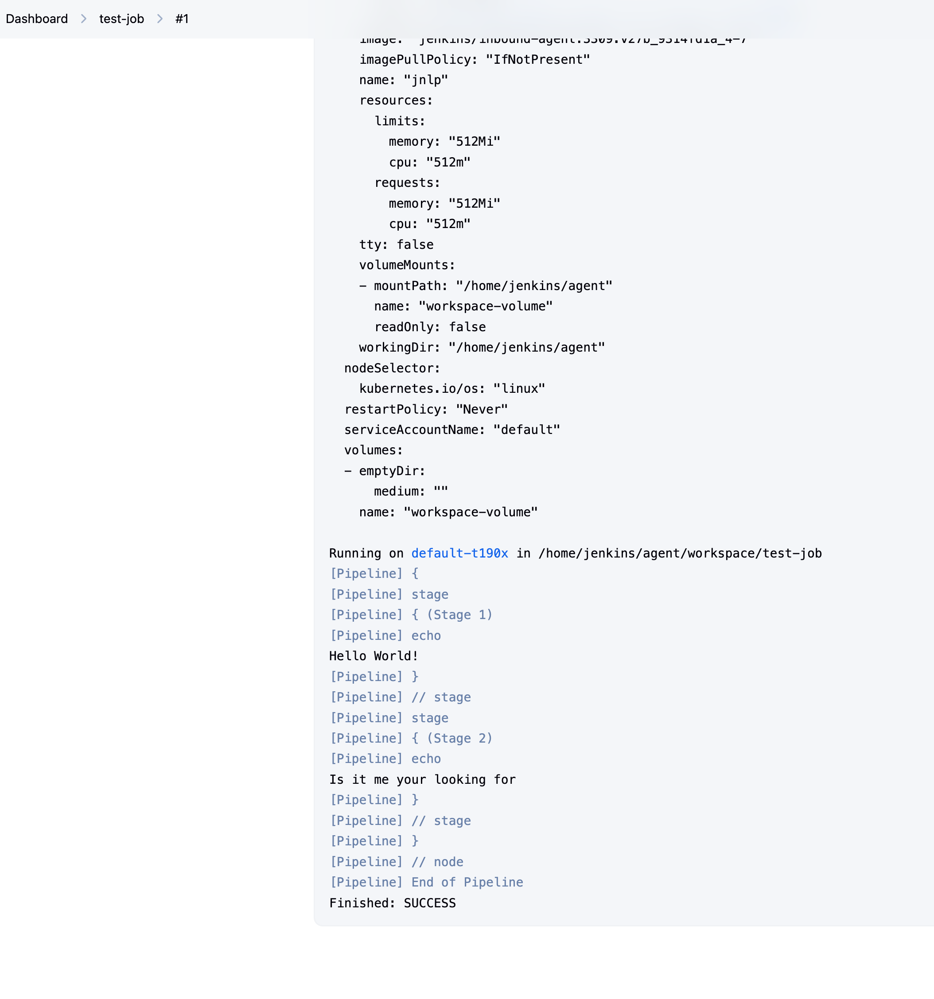
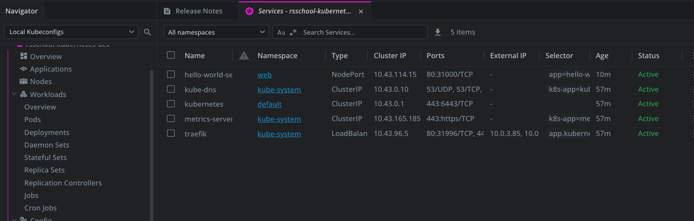
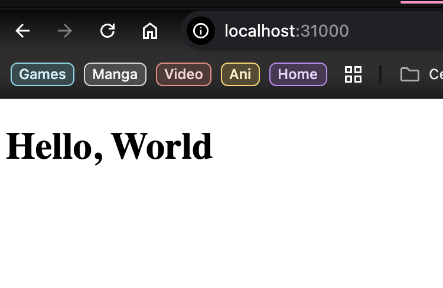

# Tasks 4: Jenkins Installation and Configuration

[](https://github.com/isbelevtsov/rsschool-devops-course-tasks/actions/workflows/terraform.yml)

______________________________________________________________________

## Overview

📌

This project will bootstrap a basic AWS infrastructure with bastion host at front and K8s Cluster using K3s that allocated behind in private subnet. When cluster will be ready you can deploy a simple web application to it using provided manifest.

______________________________________________________________________

## Table of Contents

📂

- [Before you start](#before-you-start)
- [Prerequisites](#prerequisites)
- [Features](#features)
- [Directory Structure](#directory-structure)
- [GitHub Actions Workflow](#github-actions-workflow)
- [Required GitHub Secrets](#required-github-secrets)
- [Security Best Practices Implemented](#security-best-practices-implemented)
- [Terraform Version](#terraform-version)
- [Script](#script)
- [How to manage kubernetes cluster](#how-to-manage-kubernetes-cluster)
- [Notes](#notes)
- [Usability confirmation](#usability-confirmation)

______________________________________________________________________

## Before you start

❗

Note that this task uses AWS resources that are outside the AWS free tier, so be careful!

______________________________________________________________________

## Prerequisites

⚙️

- [Terraform](https://www.terraform.io/) - Terraform is an open-source infrastructure as code software tool that provides a consistent CLI workflow to manage hundreds of cloud services. Terraform codifies cloud APIs into declarative configuration files.
- [Amazon AWS Account](https://aws.amazon.com/it/console/) - Amazon AWS account.
- [AWS CLI](https://aws.amazon.com/cli/) - Amazon AWS CLI.
- Preconfigured SSM Parameter Store secure string object with you SSH key for EC2 instance access
- Task 1 bootstrap Terraform code must be executed before running this task.
- Github Action Secrets must be already initialized throught the Github web console.
- Set variables according to your desire.

______________________________________________________________________

## Features

🔍

- VPC creation with CIDR block `10.0.0.0/16`
- 2 Public subnets in separate Availability Zones
- 2 Private subnets in separate Availability Zones
- Internet Gateway for public subnet access
- NAT Gateway for private subnet internet access
- Route tables for intra-VPC and external access
- EC2 instance profiles for each of deployed host with specific SSM Parameter Store access
- Bastion EC2 instance in the public subnet with predefined SSH key
- Private EC2 instances in private subnets with bootstraped K3s cluster that has two nodes: 1 control plane and 1 worker
- Security Groups with descriptions and rule auditing
- Network Access Lists for better subnet traffic control
- CloudWatch log group for VPC flow logs
- Tags including GitHub Actions metadata
- GitHub Actions pipeline for Terraform Plan, Apply & Destroy using OIDC

______________________________________________________________________

## Directory Structure

📂

```
.
├── .github
│   ├── actions
│   │   └── action.yml.off                   # Github Actions workflow separate action that can be reused in the pipeline
│   └── workflows
│       └── terraform.yml                    # Github Actions workflow pipeline configuration
├── task_3
│   ├── project
│   │    ├── kubernetes                      # Kubernetes manifests location for deploying a simple web server
│   │    │    ├── configmap.yaml             # Kubernetes configmap manifest
│   │    │    ├── deployment.yaml            # Kubernetes deployment manifest
│   │    │    ├── namespace.yaml             # Kubernetes namespace manifest
│   │    │    └── service.yaml               # Kubernetes service manifest
│   │    ├── scripts
│   │    │    └── get_kubeconfig.sh          # Scripts that will get kubeconfig from AWS SSM Parameter Store and save it to you system
│   │    ├── templates
│   │    │    └── user_data.tpl              # Terraform user data template for AWS EC2 instance bootstrap
│   │    ├── .env.example                    # Example file contains variables for Makefile
│   │    ├── ami.tf                          # AWS AMI configuration for future EC2 instaces deployment
│   │    ├── backend.tf                      # Terraform backend condiguration
│   │    ├── ec2.tf                          # AWS EC2 instances configuration
│   │    ├── iam.tf                          # AWS IAM configuration
│   │    ├── logs.tf                         # AWS S3 bucket logging for security purpose and KMS key configuration for data encryption
│   │    ├── Makefile                        # Makefile for better project and data magement
│   │    ├── networking.tf                   # AWS subnets and routing configuration alongside with network access lists configuration
│   │    ├── outputs.tf                      # Terraform outputs data
│   │    ├── providers.tf                    # Terraform providers configuration
│   │    ├── sg.tf                           # AWS security groups configuration for network traffic control
│   │    ├── terraform.auto.tfvars.example   # Example file contains test variables or placeholders for Terraform (only for
│   │    │                                   # local usage, Github Actions workflow will generate it in process)
│   │    ├── user_data.tpl                   # User data script template for AWS bastion EC2 instance
│   │    ├── variables.tf                    # Terraform variables configuration
│   │    └── vpc.tf                          # AWS VPC configuration
│   ├── screenshots                          # Screenshots location that mentioned in PR
│   │    └── ...
│   └── README.md                            # This file
```

______________________________________________________________________

## GitHub Actions Workflow

🔍

The `terraform.yml` workflow performs:

- Code checkout
- Terraform setup
- AWS credentials via OIDC
- `terraform init`, `validate`, `plan`, `apply`, `destroy`
- PR comment with `terraform plan` output

______________________________________________________________________

## Required GitHub Secrets

❔

| Secret Name              | Description                        |
| ------------------------ | ---------------------------------- |
| `ALLOWED_SSH_CIDR`       | CIDR block for SSH access          |
| `AWS_ACCOUNT_ID`         | AWS account ID                     |
| `AWS_REGION`             | AWS region                         |
| `AZS`                    | Comma-separated AZ list            |
| `CERT_PATH`              | SSH key file full path             |
| `GH_TOKEN`               | Github token for commenting PR     |
| `KEY_PAIR`               | EC2 key pair name                  |
| `KEY_PARAM_PATH`         | SSM Parameter Store key path       |
| `KUBECONFIG_PARAM_PATH`  | SSM Parameter Store key path       |
| `PRIVATE_SUBNET_CIDRS`   | Comma-separated CIDRs for private  |
| `PUBLIC_SUBNET_CIDRS`    | Comma-separated CIDRs for public   |
| `TF_VERSION`             | Terraform version                  |
| `VPC_CIDR`               | VPC CIDR block                     |

### Other variables that can be set inside terraform.yml

❔

| Variable Name            | Description                                                                   |
| ------------------------ | ----------------------------------------------------------------------------- |
| `INSTANCE_TYPE_BASTION`  | EC2 Instance type for bastion host (min.req."t3.nano")                        |
| `INSTANCE_TYPE_CP`       | EC2 Instance type for kubernetes controlplane node host (min.req."t3.medium") |
| `INSTANCE_TYPE_WORKER`   | EC2 Instance type for kubernetes worker node host (min.req."t3.small")        |

______________________________________________________________________

## Security Best Practices Implemented

🛡️

- IMDSv2 enforcement for EC2 (AVD-AWS-0028)
- Encrypted root EBS volumes (AVD-AWS-0131)
- Security group and rule descriptions (AVD-AWS-0099, AVD-AWS-0124)
- VPC Flow Logs enabled (AVD-AWS-0178)
- CloudWatch Log Group encryption awareness (AVD-AWS-0017)

______________________________________________________________________

## Terraform Version

🔖

Tested with Terraform `1.12.0`

______________________________________________________________________

## Script

💻

This script automates the process of securely retrieving a Kubernetes `kubeconfig` file from AWS Systems Manager (SSM) Parameter Store and saving it locally to the `~/.kube/` directory for use with `kubectl`.

### Prerequisites

⚙️

- AWS CLI installed and configured
- Access to AWS SSM Parameter Store with necessary IAM permissions
- Kubernetes `kubeconfig` file already stored as a secure SSM parameter
- Linux/macOS shell (e.g., Bash)

### Script Variables

❔

You need to **set the following variables** before running the script:

```bash
AWS_DEFAULT_REGION=           # e.g., "us-west-2"
AWS_PROFILE=                  # AWS CLI profile name
AWS_ACCESS_KEY_ID=            # Your AWS access key
AWS_SECRET_ACCESS_KEY=        # Your AWS secret access key
SSM_PARAMETER_NAME="/path/to/your/key"  # Full name of the SSM parameter (e.g., "/prod/k3s/kubeconfig")
KUBECONFIG_PATH="~/.kube"     # Path where kubeconfig will be stored
```

### Script Workflow

🔍

1. **Input Validation**

   - Checks that all required environment variables are set.
   - If any are missing, the script exits with an error.

1. **Kubeconfig Directory Check**

   - If the `~/.kube` directory does not exist, it is created.

1. **Backup Existing Kubeconfig**

   - If a kubeconfig file already exists, it is backed up as `kubeconfig.bak`.

1. **Retrieve Kubeconfig from SSM**

   - The script uses the AWS CLI to fetch the parameter value from SSM.
   - The retrieved content is saved to `~/.kube/kubeconfig`.

1. **Secure Permissions**

   - The kubeconfig file is set to `chmod 600` for secure access.

1. **Optional KUBECONFIG Export**

   - The script includes a commented-out `export KUBECONFIG=...` line in case you want to make this kubeconfig the default for your shell session.

### Example Usage

🧪

```bash
export AWS_DEFAULT_REGION="us-west-2"
export AWS_PROFILE="default"
export AWS_ACCESS_KEY_ID="AKIA..."
export AWS_SECRET_ACCESS_KEY="..."
export SSM_PARAMETER_NAME="/prod/k3s/kubeconfig"
export KUBECONFIG_PATH=../kubernetes

bash get_kubeconfig.sh
```

> 💡 You may also set these variables directly in the script or through a `.env` file if preferred.

### Output

📁

- The kubeconfig file will be available at:\
  `task_3/project/kubernetes/kubeconfig`

- If a file already existed, it will be backed up as:\
  `task_3/project/kubernetes/kubeconfig.bak`

______________________________________________________________________

## How to manage kubernetes cluster

🔧

1. You will need to get output from you Github Action pipeline that contains `bastion_public_ip`, `k3s_control_plane_private_ip` or check it from your AWS Web Console/CLI.

1. Run this command to establish SSH tunnel from your local PC to K3s control plane node:

```bash
ssh -i /ssh/key/path -L localhost:6443:k3s_control_plane_private_ip:6443 ubuntu@bastion_public_ip
```

*Dont forget to change `/ssh/key/path` with your actual SSH key that used to access your EC2 instances, `k3s_control_plane_private_ip` and `bastion_public_ip` with your actual IP addresses taked from step 1.*
Tunnel will be exist till your ssh remote session lives.

3. If you aleady export you `$KUBECONFIG` system variable with kibeconfig configuration file location then you can run `kubectl` commands as well as you can import kubeconfig to any Kubernetes IDE like **Lens** from Mirantis.

______________________________________________________________________

In this path `task_3/project/kubernetes` you can find kubernetes manifests that can be deployed to our kubernetes cluster to achieve next goals:

- Create `Namespace` with name **Web**.
- Create `ConfigMap` with simple one page **Hello World** site.
- Create `Deployment` pod that will be serve our web application.
- Create `Service` to be able rich our web server and check that all works fine.

To do this go to mentioned path and run this commands:

```bash
ssh -i /ssh/key/path -L localhost:31000:k3s_control_plane_private_ip:31000 ubuntu@bastion_public_ip
```

to establish one more SSH tunnel to cluster and then

*Dont forget to change `/ssh/key/path` with your actual SSH key that used to access your EC2 instances,  `k3s_control_plane_private_ip` and `bastion_public_ip` with your actual IP addresses.*

```bash
cd ./task_3/project/kubernetes/
KUBECONFIG=kubeconfig kubectl apply -f .
```

After that you can test that all work by open [locahost:31000](http://localhost:31000/) in your web browser or by running `curl http://localhost:31000/` command from your terminal.

## Notes

📎

- All tagging includes `Task`, `ManagedBy`, `CI`, and `Date` fields.
- `output.tfplan` is commented on PRs automaticaly.
- All resources can be destroyed using the same way as `Plan` or `Apply`.

______________________________________________________________________

## Usability confirmation

✅

<details><summary>Resources creation and usage proofs</summary>

### AWS VPC Resource map<br>

<br>

### AWS EC2 instances<br>

<br>

### NAT gateway for private network<br>

<br>

### Kubernetes cluster overview from Lens<br>

<br>

### Kubernetes cluster Nodes overview<br>

<br>

### Kubernetes cluster Deployments overview<br>

<br>

### Kubernetes cluster ConfigMaps overview<br>

<br>

### Kubernetes cluster Services overview<br>

<br>

### Web browser connectivity test<br>

<br>

</details>
