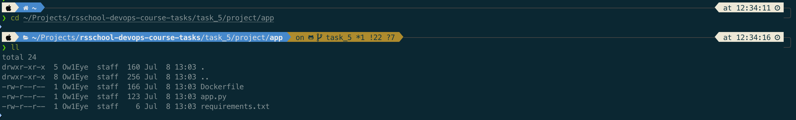
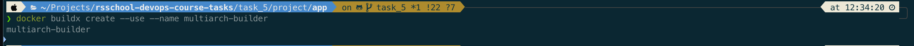
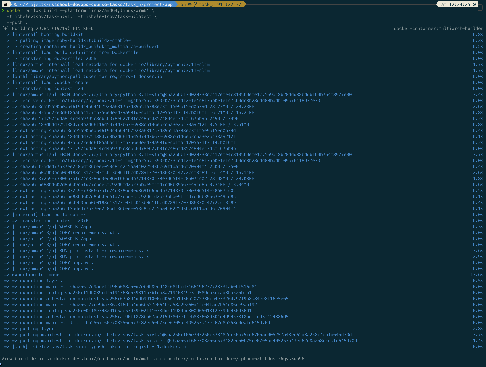
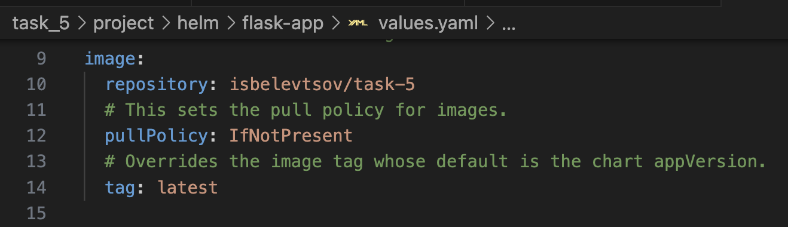
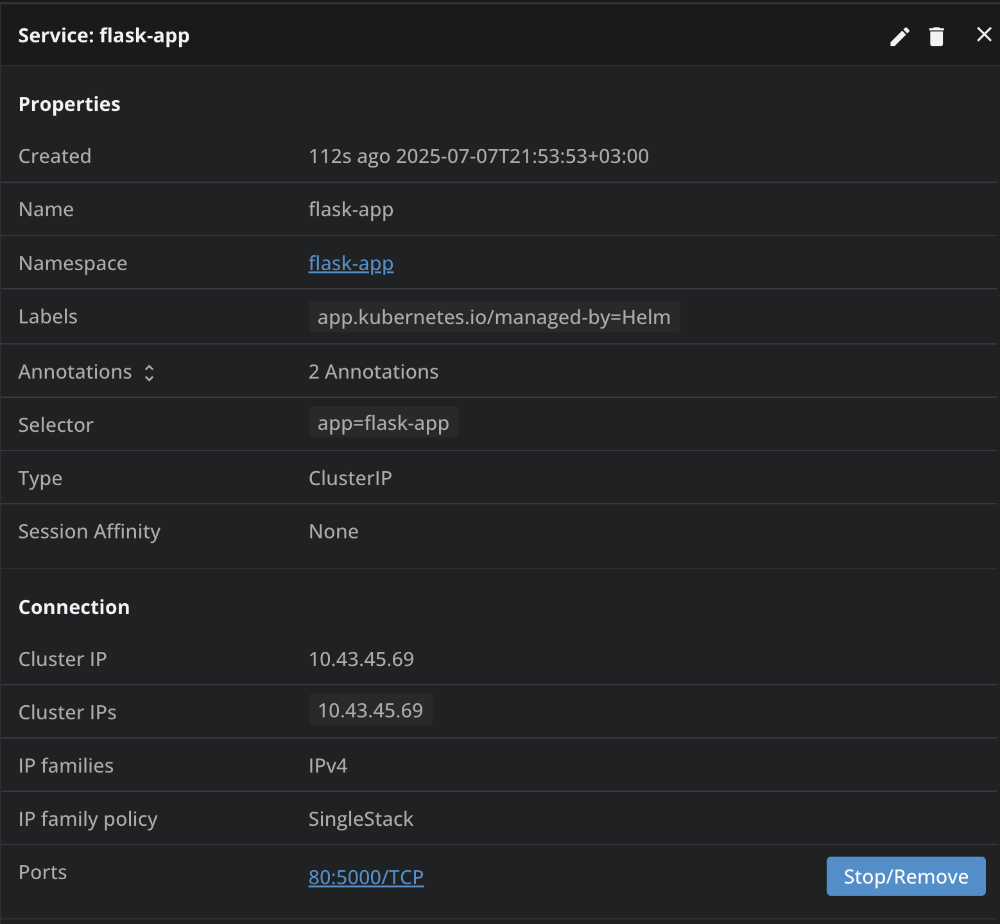
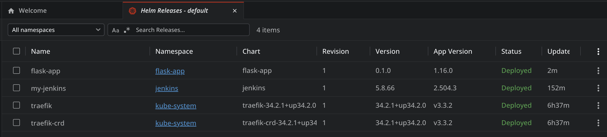
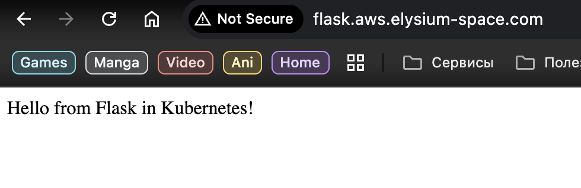

# Tasks 5: Simple Application Deployment with Helm

[](https://github.com/isbelevtsov/rsschool-devops-course-tasks/actions/workflows/terraform.yml)

______________________________________________________________________

## Overview

📌

This project will bootstrap a basic AWS infrastructure with bastion host at front and K8s Cluster using K3s that allocated behind in private subnet. When cluster will be ready you can deploy a Jenkins CI/CD tool and Flask simple app with GHA that can be runned manually after bootstrap.

______________________________________________________________________

## Table of Contents

📂

- [Before you start](#before-you-start)
- [Prerequisites](#prerequisites)
- [Features](#features)
- [Directory Structure](#directory-structure)
- [GitHub Actions Workflow](#github-actions-workflow)
- [Required GitHub Secrets](#required-github-secrets)
- [Security Best Practices Implemented](#security-best-practices-implemented)
- [Terraform Version](#terraform-version)
- [Script](#script)
- [How to manage kubernetes cluster](#how-to-manage-kubernetes-cluster)
- [GitHub Actions Workflow: K8s Management](#github-actions-workflow-k8s-management)
- [Notes](#notes)
- [Usability confirmation](#usability-confirmation)

______________________________________________________________________

## Before you start

❗

Note that this task uses AWS resources that are outside the AWS free tier, so be careful!

______________________________________________________________________

## Prerequisites

⚙️

- [Terraform](https://www.terraform.io/) - Terraform is an open-source infrastructure as code software tool that provides a consistent CLI workflow to manage hundreds of cloud services. Terraform codifies cloud APIs into declarative configuration files.
- [Amazon AWS Account](https://aws.amazon.com/it/console/) - Amazon AWS account.
- [AWS CLI](https://aws.amazon.com/cli/) - Amazon AWS CLI.
- [Docker](https://www.docker.com/products/docker-desktop/) - Docker desktop engine.
- Preconfigured SSM Parameter Store secure string object with you SSH key for EC2 instance access.
- Task 1 bootstrap Terraform code must be executed before running this task.
- Github Action Secrets must be already initialized throught the Github web console.
- Set variables according to your desire.

______________________________________________________________________

## Features

🔍

- VPC creation with CIDR block `10.0.0.0/16`
- 2 Public subnets in separate Availability Zones
- 2 Private subnets in separate Availability Zones
- Internet Gateway for public subnet access
- NAT Gateway for private subnet internet access
- Route tables for intra-VPC and external access
- EC2 instance profiles for each of deployed host with specific SSM Parameter Store access
- Bastion EC2 instance in the public subnet with predefined SSH key
- Private EC2 instances in private subnets with bootstraped K3s cluster that has two nodes: 1 control plane and 1 worker
- Remote provisioners for each EC2 instances for prerequisites configuration
- Security Groups with descriptions and rule auditing
- Network Access Lists for better subnet traffic control
- CloudWatch log group for VPC flow logs
- Tags including GitHub Actions metadata
- GitHub Actions pipeline for Terraform Plan, Apply & Destroy using OIDC
- GitHub Actions pipiline for Jenkins CI/CD and Flask app deployment into K3s kubernetes cluster

______________________________________________________________________

## Directory Structure

📂

```
.
├── .github
│   └── workflows
│       ├── infrastructure_deployment.yml         # Github Actions workflow pipeline configuration that will bootstrap prerequisites infrastructure
│       └── k8s_management.yml                    # Github Actions workflow pipeline configuration that will deploy k8s resources inside the cluster
├── task_5
│   ├── project
│   │    ├── app
│   │    │    ├── app.py                          # Simple python flask application
│   │    │    ├── Dockerfile                      # Docker image build file
│   │    │    └── requirements.txt                # Python package requirements for application
│   │    ├── helm
│   │    │    └── flask-app                       # Flask application custom Helm chart
│   │    │         └── ...
│   │    ├── kubernetes                           # Kubernetes manifests location for deploying into cluster
│   │    │    ├── app
│   │    │    │    ├── app_configmap.yaml         # Web App configmap manifest
│   │    │    │    ├── app_deployment.yaml        # Web App deployment manifest
│   │    │    │    ├── app_namespace.yaml         # Web App namespace manifest
│   │    │    │    ├── app_service.yaml           # Web App service manifest
│   │    │    │    └── ebs_storage_class.yaml     # EBS storage class for PV/PVC manifest
│   │    │    └── jenkins
│   │    │         ├── jenkins_ingress_route.yaml # Jenkins Traeffic ingress route manifest
│   │    │         ├── jenkins_pv.yaml            # Jenkins persistent volume manifest
│   │    │         ├── jenkins_pvc.yaml           # Jenkins persistent volume claims manifest
│   │    │         ├── jenkins_sa.yaml            # Jenkins service account manifest
│   │    │         ├── jenkins_storage_class.yaml # Jenkins local path storage class manifest
│   │    │         └── jenkins_values.yaml.j2     # Jenkins values Jinja2 template for Helm chart deployment manifest
│   │    ├── scripts
│   │    │    └── get_kubeconfig.sh               # Scripts that will get kubeconfig from AWS SSM Parameter Store and save it to you system
│   │    └── terraform
│   │         ├── templates
│   │         │    ├── bastion.sh                 # Terraform user data template for AWS EC2 instance bootstrap
│   │         │    ├── controlplane.sh            # Terraform user data template for AWS EC2 instance bootstrap
│   │         │    ├── nginx_flask.tpl            # Nginx reverse proxy configuration template for Flask app
│   │         │    ├── nginx_jenkins.tpl          # Nginx reverse proxy configuration template for Jenkins
│   │         │    ├── nginx_k3s.tpl              # Nginx reverse proxy configuration template for K3s cluster API server
│   │         │    └── worker.sh                  # Terraform user data template for AWS EC2 instance bootstrap
│   │         ├── .env.example                    # Example file contains variables for Makefile
│   │         ├── ec2.tf                          # AWS EC2 instances configuration
│   │         ├── iam.tf                          # AWS IAM configuration
│   │         ├── dns.tf                          # AWS Route53 DNS configuration
│   │         ├── logs.tf                         # AWS S3 bucket logging for security purpose and KMS key configuration for data encryption
│   │         ├── Makefile                        # Makefile for better project and data magement
│   │         ├── networking.tf                   # AWS subnets and routing configuration alongside with network access lists configuration
│   │         ├── outputs.tf                      # Terraform outputs data
│   │         ├── providers.tf                    # Terraform providers configuration
│   │         ├── sg.tf                           # AWS security groups configuration for network traffic control
│   │         ├── terraform.auto.tfvars.example   # Example file contains test variables or placeholders for Terraform (only for
│   │         │                                   # local usage, Github Actions workflow will generate it in process)
│   │         └── variables.tf                    # Terraform variables configuration
│   ├── screenshots                               # Screenshots location that mentioned in PR
│   │    └── ...
│   └── README.md                                 # This file
```

______________________________________________________________________

## Docker image build preparation

You need to build your Flask image from scratch. To do that you'll need to use Docker engine. After you'll install it open console and do next steps:

- Authenticate to your Docker Hub account

```bash
docker login
```

- Locate to the directory with Dockerfile

```bash
cd task_5/project/app
```

<details><summary>App folder content</summary>

<br>

</details><br>

- Create multi-platform builder (you'll need it to be able to use your image on any architecture platform)

```bash
docker buildx create --use --name multiarch-builder
```

<details><summary>Creation multi-architecture image builder</summary>

<br>

</details><br>

- Build your own image and push it to your Docker Hub account

```bash
docker buildx build --platform linux/amd64,linux/arm64 \
  -t username/image_name:custom_tag -t username/image_name:latest \
  --push .
```

<details><summary>Docker image build and push process</summary>

<br>

</details><br>

> Dont forget to change `username` to your Docker Hub user account, `image_name` to your defined Docker image name and `custom_tag` to your defined tag (for example: `isbelevtsov/task-5:v1.0`). It's a best practice to add more than one tag to your images to able to track latest version actual. When this process will be done you'll need to adjust Flask-app Helm chart `values.yaml` file to use your actual image repository in this section:
> <br>

______________________________________________________________________

## GitHub Actions Workflow

🔍

The `infrastructure_deployment.yml` workflow performs:

- Code checkout
- Terraform setup
- AWS credentials via OIDC
- `terraform init`, `validate`, `plan`, `apply`, `destroy`
- `update dns`, `remove dns`
- PR comment with `terraform plan` output

The `k8s_management.yml` workflow performs:

- Code checkout
- Helm setup
- Deploy Jenkins Helm chart to K3s cluster with all prerequisites
- Deploy Flask app Helm chart to K3s cluster
- PR comment with Jenkins Helm chart deployment info

______________________________________________________________________

## Required GitHub Secrets

❔

| Secret Name              | Description                        |
| ------------------------ | ---------------------------------- |
| `ALLOWED_SSH_CIDR`       | CIDR block for SSH access          |
| `AWS_ACCOUNT_ID`         | AWS account ID                     |
| `AWS_REGION`             | AWS region                         |
| `AZS`                    | Comma-separated AZ list            |
| `BASTION_CF_RECORD_NAME` | Bastion DNS A-record hostname      |
| `CERT_PATH`              | SSH key file full path             |
| `CF_API_TOKEN`           | CloudFlare API token               |
| `CF_ZONE_ID`             | CloudFlare Zone ID                 |
| `GH_TOKEN`               | Github token for commenting PR     |
| `JENKINS_CF_RECORD_NAME` | Jenkins DNS A-record hostname      |
| `KEY_PAIR`               | EC2 key pair name                  |
| `KEY_PARAM_PATH`         | SSM Parameter Store key path       |
| `KUBECONFIG_PARAM_PATH`  | SSM Parameter Store key path       |
| `K8S_CF_RECORD_NAME`     | K3s cluster DNS A-record hostname  |
| `NODE_TOKEN_PARAM_PATH`  | SSM Parameter Store key path       |
| `PRIVATE_SUBNET_CIDRS`   | Comma-separated CIDRs for private  |
| `PUBLIC_SUBNET_CIDRS`    | Comma-separated CIDRs for public   |
| `TF_VERSION`             | Terraform version                  |
| `VPC_CIDR`               | VPC CIDR block                     |

### Other variables that can be set inside terraform.yml

❔

| Variable Name            | Description                                                                   |
| ------------------------ | ----------------------------------------------------------------------------- |
| `INSTANCE_TYPE_BASTION`  | EC2 Instance type for bastion host (min.req."t3.nano")                        |
| `INSTANCE_TYPE_CP`       | EC2 Instance type for kubernetes controlplane node host (min.req."t3.medium") |
| `INSTANCE_TYPE_WORKER`   | EC2 Instance type for kubernetes worker node host (min.req."t3.small")        |
| `JENKINS_DATA_DIR`       | Jenkins persistent data mounting point path                                   |
| `TASK_DIR`               | Current task working directory path                                           |

______________________________________________________________________

## Security Best Practices Implemented

🛡️

- IMDSv2 enforcement for EC2 (AVD-AWS-0028)
- Encrypted root EBS volumes (AVD-AWS-0131)
- Security group and rule descriptions (AVD-AWS-0099, AVD-AWS-0124)
- VPC Flow Logs enabled (AVD-AWS-0178)
- CloudWatch Log Group encryption awareness (AVD-AWS-0017)

______________________________________________________________________

## Terraform Version

🔖

Tested with Terraform `1.12.0`

______________________________________________________________________

## Script

💻

This script automates the process of securely retrieving a Kubernetes `kubeconfig` file from AWS Systems Manager (SSM) Parameter Store and saving it locally to the `~/.kube/` directory for use with `kubectl`.

### Prerequisites

⚙️

- AWS CLI installed and configured
- Access to AWS SSM Parameter Store with necessary IAM permissions
- Kubernetes `kubeconfig` file already stored as a secure SSM parameter
- Linux/macOS shell (e.g., Bash)

### Script Variables

❔

You need to **set the following variables** before running the script:

```bash
AWS_DEFAULT_REGION=           # e.g., "us-west-2"
AWS_PROFILE=                  # AWS CLI profile name
AWS_ACCESS_KEY_ID=            # Your AWS access key
AWS_SECRET_ACCESS_KEY=        # Your AWS secret access key
SSM_PARAMETER_NAME="/path/to/your/key"  # Full name of the SSM parameter (e.g., "/prod/k3s/kubeconfig")
KUBECONFIG_PATH="~/.kube"     # Path where kubeconfig will be stored
```

### Script Workflow

🔍

1. **Input Validation**

   - Checks that all required environment variables are set.
   - If any are missing, the script exits with an error.

1. **Kubeconfig Directory Check**

   - If the `~/.kube` directory does not exist, it is created.

1. **Backup Existing Kubeconfig**

   - If a kubeconfig file already exists, it is backed up as `kubeconfig.bak`.

1. **Retrieve Kubeconfig from SSM**

   - The script uses the AWS CLI to fetch the parameter value from SSM.
   - The retrieved content is saved to `~/.kube/kubeconfig`.

1. **Secure Permissions**

   - The kubeconfig file is set to `chmod 600` for secure access.

1. **Optional KUBECONFIG Export**

   - The script includes a commented-out `export KUBECONFIG=...` line in case you want to make this kubeconfig the default for your shell session.

### Example Usage

🧪

```bash
export AWS_DEFAULT_REGION="us-west-2"
export AWS_PROFILE="default"
export AWS_ACCESS_KEY_ID="AKIA..."
export AWS_SECRET_ACCESS_KEY="..."
export SSM_PARAMETER_NAME="/prod/k3s/kubeconfig"
export KUBECONFIG_PATH=../kubernetes

bash get_kubeconfig.sh
```

> 💡 You may also set these variables directly in the script or through a `.env` file if preferred.

### Output

📁

- The kubeconfig file will be available at:\
  `task_3/project/kubernetes/kubeconfig`

- If a file already existed, it will be backed up as:\
  `task_3/project/kubernetes/kubeconfig.bak`

______________________________________________________________________

## How to manage kubernetes cluster

### Solution 1:

🔧

1. You will need to get output from you Github Action pipeline that contains `bastion_public_ip`, `k3s_control_plane_private_ip` or check it from your AWS Web Console/CLI.

1. Run this command to establish SSH tunnel from your local PC to K3s control plane node:

```bash
ssh -i /ssh/key/path -L localhost:6443:k3s_control_plane_private_ip:6443 ubuntu@bastion_public_ip
```

*Dont forget to change `/ssh/key/path` with your actual SSH key that used to access your EC2 instances, `k3s_control_plane_private_ip` and `bastion_public_ip` with your actual IP addresses taked from step 1.*
Tunnel will be exist till your ssh remote session lives.

3. If you aleady export you `$KUBECONFIG` system variable with kibeconfig configuration file location then you can run `kubectl` commands as well as you can import kubeconfig to any Kubernetes IDE like **Lens** from Mirantis.

______________________________________________________________________

In this path `task_4/project/kubernetes` you can find kubernetes manifests that can be deployed to our kubernetes cluster to achieve next goals:

- Create `Namespace` with name **Web**.
- Create `ConfigMap` with simple one page **Hello World** site.
- Create `Deployment` pod that will be serve our web application.
- Create `Service` to be able rich our web server and check that all works fine.

To do this go to mentioned path and run this commands:

```bash
ssh -i /ssh/key/path -L localhost:31000:k3s_control_plane_private_ip:31000 ubuntu@bastion_public_ip
```

to establish one more SSH tunnel to cluster and then

*Dont forget to change `/ssh/key/path` with your actual SSH key that used to access your EC2 instances,  `k3s_control_plane_private_ip` and `bastion_public_ip` with your actual IP addresses.*

```bash
cd ./task_4/project/kubernetes/
KUBECONFIG=kubeconfig kubectl apply -f .
```

After that you can test that all work by open [locahost:31000](http://localhost:31000/) in your web browser or by running `curl http://localhost:31000/` command from your terminal.

### Solution 2:

You can use predefined Nginx reverse proxy server that traslates connections to both K8s API server and Jenkins deployment from the next GHA workflow mentioned below.

To achive that you can store you external DNS record in any DNS registrar e.g. CloudFlare, Amazon Route53, etc.

## GitHub Actions Workflow: K8s Management

This workflow automates the deployment of Jenkins to a self-hosted AWS K3s Kubernetes cluster using Helm, and is triggered either manually or after a successful infrastructure deployment workflow.

______________________________________________________________________

### 🔧 Trigger Conditions

- `workflow_dispatch`: Manual trigger
- `workflow_run`: Triggered when the **Infrastructure Deployment** workflow completes on the `task_4` branch

______________________________________________________________________

### 🔐 Required Secrets

| Secret Name              | Description                                 |
|--------------------------|---------------------------------------------|
| `AWS_REGION`             | AWS region                                  |
| `AWS_ACCOUNT_ID`         | AWS account ID                              |
| `JENKINS_ADMIN_USER`     | Jenkins admin username                      |
| `JENKINS_ADMIN_PASSWORD` | Jenkins admin password                      |
| `KUBECONFIG_PARAM_PATH`  | SSM path to the kubeconfig for the cluster  |

______________________________________________________________________

### 📦 Job: `deploy_jenkins`

#### Environment Variables

All tasks assume the project path is located under `task_4/project`.

#### Main Steps

1. **Checkout Code**

   - Clones the repository for use in this job.

1. **Configure AWS Credentials**

   - Uses OIDC to assume the configured IAM role and authenticate with AWS.

1. **Get GitHub Runner IP**

   - Captures the runner's public IP to allow temporary access to the cluster.

1. **Get Bastion Security Group ID**

   - Dynamically retrieves the SG ID using the `Name=*bastion*` filter.

1. **Add GitHub Runner IP to SG**

   - Adds an ingress rule to allow kubectl access to the cluster.

1. **Set Up Kubeconfig**

   - Downloads the kubeconfig from AWS SSM and rewrites the server hostname for public access.

1. **Debug Kubeconfig**

   - Lists and previews the kubeconfig file to confirm setup.

1. **Install Helm**

   - Installs Helm CLI v3.18.3 using `azure/setup-helm`.

1. **Create Jenkins Namespace**

   - Idempotent namespace creation using dry-run logic.

1. **Create Jenkins service account**

   - Create a Kubernetes service account for Jenkins resource management.

1. **Create Jenkins Admin Secret**

   - Creates a Kubernetes secret from GitHub secrets for Jenkins admin login.

1. **Apply Persistent Storage (Optional)**

   - Applies preconfigured storage class, persistent volume, and PVC manifests.

1. **Deploy Jenkins via Helm**

   - Deploys Jenkins with the official Helm chart and a `jenkins_values.yaml` file.

1. **Apply Ingress (Optional)**

   - Applies ingress configuration to expose Jenkins via hostname.

1. **Collect Jenkins Info**

   - Captures `kubectl get svc` and `helm status` output for PR reporting.

1. **Remove Runner IP from SG**

   - Cleans up ingress rule added earlier to restrict cluster access.

1. **Comment Deployment Info on PR**

   - Posts Jenkins deployment status back to the pull request.

______________________________________________________________________

### 📝 Notes

- This workflow supports secure dynamic access by modifying security groups temporarily.
- It ensures the kubeconfig is valid and readable before executing any Helm or kubectl commands.
- PR comments allow easy visibility into deployment status without leaving GitHub.

## Notes

📎

- All tagging includes `Task`, `ManagedBy`, `CI`, and `Date` fields.
- `output.tfplan` is commented on PRs automaticaly.
- All resources can be destroyed using the same way as `Plan` or `Apply`.

______________________________________________________________________

## Usability confirmation

✅

<details><summary>Resources creation and usage proofs</summary>

### Flask-app service overview<br>

<br>

### Flask-app Helm chart release overview<br>

<br>

### Web browser connectivity test<br>

<br>

</details>
