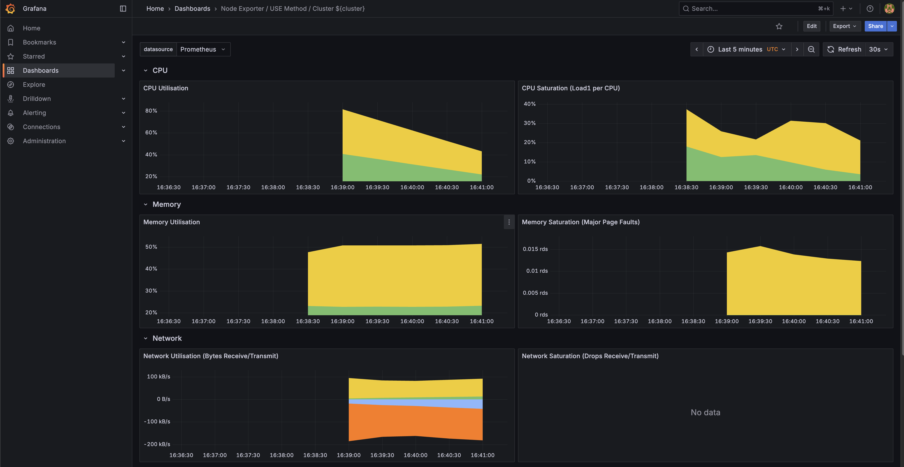
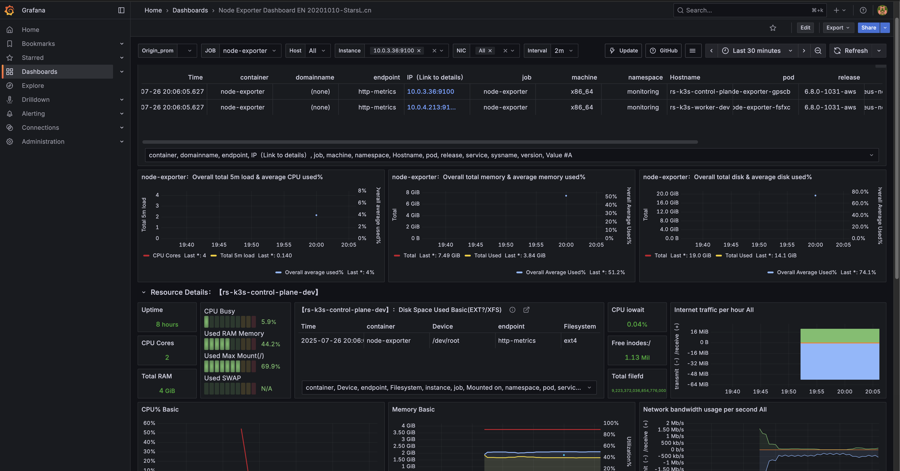
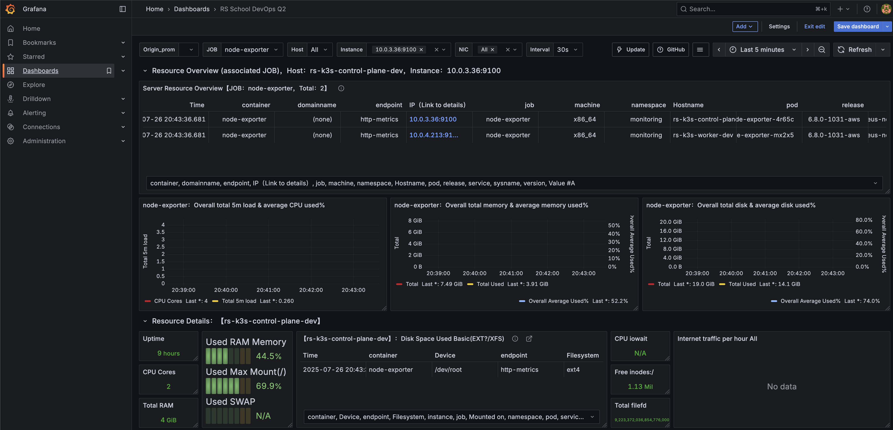
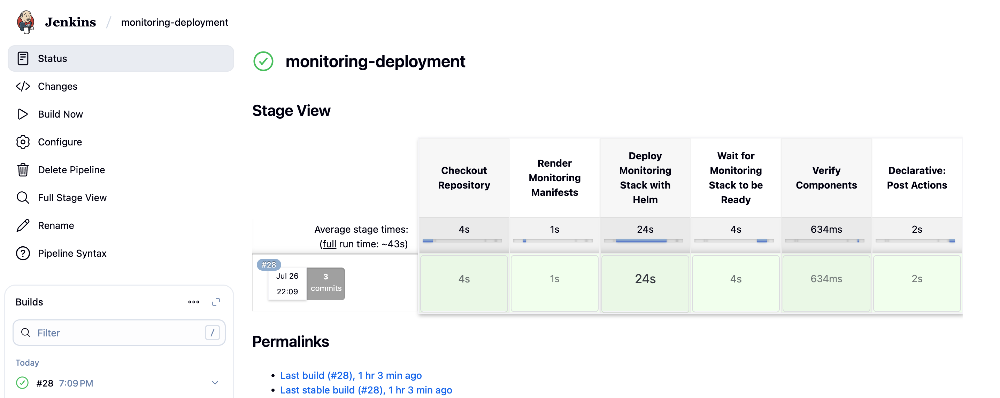
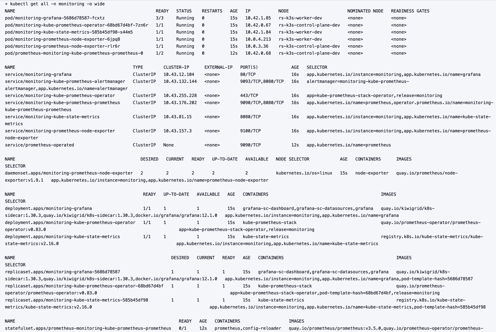
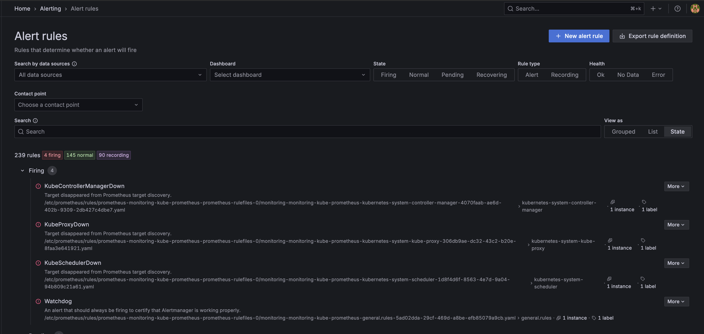
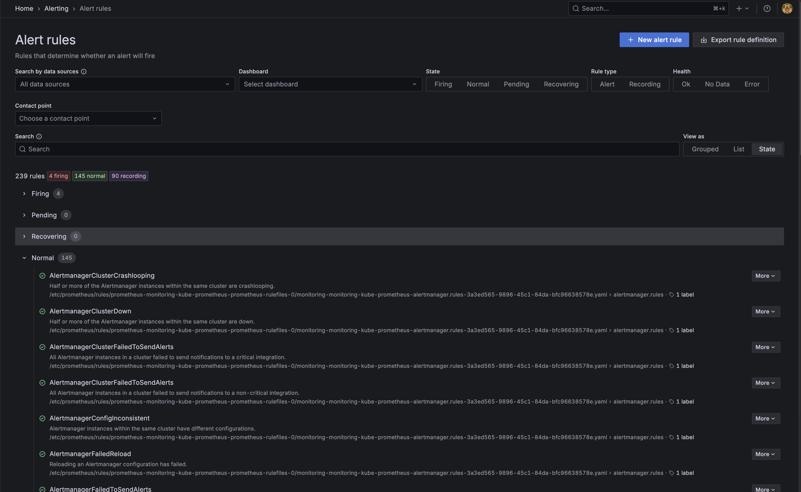
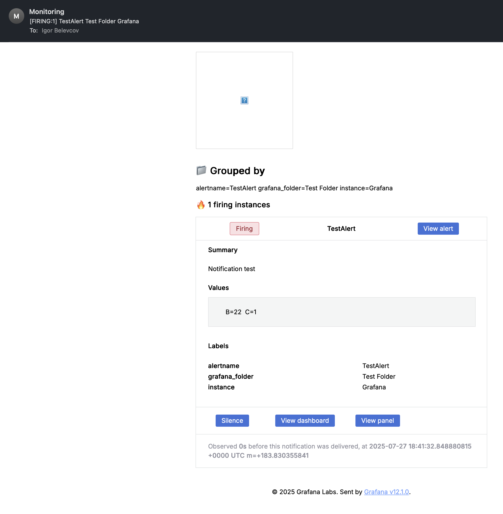

# Tasks 7: Monitoring Deployment on K8s

[](https://github.com/isbelevtsov/rsschool-devops-course-tasks/actions/workflows/terraform.yml)

______________________________________________________________________

## Overview

📌

This project will bootstrap a basic AWS infrastructure with bastion host at front and K8s Cluster using K3s that allocated behind in private subnet. When cluster will be ready you can deploy a Jenkins CI/CD tool and Flask simple app with GHA that can be runned manually after bootstrap.

______________________________________________________________________

## Table of Contents

📂

- [Before you start](#before-you-start)
- [Prerequisites](#prerequisites)
- [Features](#features)
- [Directory Structure](#directory-structure)
- [GitHub Actions Workflow](#github-actions-workflow)
- [Required GitHub Secrets](#required-github-secrets)
- [Security Best Practices Implemented](#security-best-practices-implemented)
- [Terraform Version](#terraform-version)
- [Script](#script)
- [How to manage kubernetes cluster](#how-to-manage-kubernetes-cluster)
- [GitHub Actions Workflow: K8s Management](#github-actions-workflow-k8s-management)
- [Jenkins](#jenkins)
- [Monitoring](#monitoring)
- [Notes](#notes)
- [Usability confirmation](#usability-confirmation)

______________________________________________________________________

## Before you start

❗

Note that this task uses AWS resources that are outside the AWS free tier, so be careful!

______________________________________________________________________

## Prerequisites

⚙️

- [Terraform](https://www.terraform.io/) - Terraform is an open-source infrastructure as code software tool that provides a consistent CLI workflow to manage hundreds of cloud services. Terraform codifies cloud APIs into declarative configuration files.
- [Amazon AWS Account](https://aws.amazon.com/it/console/) - Amazon AWS account.
- [AWS CLI](https://aws.amazon.com/cli/) - Amazon AWS CLI.
- (Optional)[Docker](https://www.docker.com/products/docker-desktop/) - Docker desktop engine.
- Task 1 bootstrap Terraform code must be executed before running this task.
- Github Action Secrets and Variables must be already initialized throught the Github web console.
- Set variables according to your desire.

______________________________________________________________________

## Features

🔍

- VPC creation with CIDR block `10.0.0.0/16`
- 2 Public subnets in separate Availability Zones
- 2 Private subnets in separate Availability Zones
- Internet Gateway for public subnet access
- NAT Gateway for private subnet internet access
- Route tables for intra-VPC and external access
- EC2 instance profiles for each of deployed host with specific SSM Parameter Store access
- Bastion EC2 instance in the public subnet with predefined SSH key
- Private EC2 instances in private subnets with bootstraped K3s cluster that has two nodes: 1 control plane and 1 worker
- Remote provisioners for each EC2 instances for prerequisites configuration
- Security Groups with descriptions and rule auditing
- Network Access Lists for better subnet traffic control
- CloudWatch log group for VPC flow logs
- Tags including GitHub Actions metadata
- GitHub Actions pipeline for Terraform Plan, Apply & Destroy using OIDC
- GitHub Actions pipiline for Jenkins CI/CD and Flask app deployment into K3s kubernetes cluster

______________________________________________________________________

## Directory Structure

📂

```
.
├── .github
│   └── workflows
│       ├── infrastructure_deployment.yml         # Github Actions workflow pipeline configuration that will bootstrap prerequisites infrastructure
│       └── k8s_management.yml                    # Github Actions workflow pipeline configuration that will deploy k8s resources inside the cluster
├── task_6
│   ├── project
│   │    ├── app
│   │    │    ├── app.py                          # Simple python flask application
│   │    │    ├── Dockerfile                      # Docker image build file
│   │    │    ├── requirements.txt                # Python package requirements for application
│   │    │    └── test_app.py                     # Unit-test for our Flask application
│   │    ├── helm
│   │    │    └── flask-app                       # Flask application custom Helm chart
│   │    │         └── ...
│   │    ├── jenkins
│   │    │    └── Jenkinsfile                     # Jenkins pipeline script for Flask application CI/CD process
│   │    ├── kubernetes                           # Kubernetes manifests location for deploying into cluster
│   │    │    ├── app
│   │    │    │    ├── app_configmap.yaml         # Web App configmap manifest
│   │    │    │    ├── app_deployment.yaml        # Web App deployment manifest
│   │    │    │    ├── app_namespace.yaml         # Web App namespace manifest
│   │    │    │    ├── app_service.yaml           # Web App service manifest
│   │    │    │    └── ebs_storage_class.yaml     # EBS storage class for PV/PVC manifest
│   │    │    ├── jenkins
│   │    │    │    ├── jenkins_ingress_route.yaml.j2 # Jenkins Jinja2 template for Traeffic ingress route manifest
│   │    │    │    ├── jenkins_pv.yaml.j2            # Jenkins Jinja2 template for persistent volume manifest
│   │    │    │    ├── jenkins_pvc.yaml              # Jenkins persistent volume claims manifest
│   │    │    │    ├── jenkins_sa.yaml               # Jenkins service account manifest
│   │    │    │    ├── jenkins_storage_class.yaml    # Jenkins local path storage class manifest
│   │    │    │    └── jenkins_values.yaml.j2        # Jenkins values Jinja2 template for Helm chart deployment manifest
│   │    │    └── kube2iam.yaml.j2                # Kube2IAM deployment configuration manifest for pod IAM role assuming
│   │    ├── scripts
│   │    │    └── get_kubeconfig.sh               # Scripts that will get kubeconfig from AWS SSM Parameter Store and save it to you system
│   │    └── terraform
│   │         ├── templates
│   │         │    ├── bastion.sh                 # Terraform user data template for AWS EC2 instance bootstrap
│   │         │    ├── k3s-control-plane.sh       # Terraform user data template for AWS EC2 instance bootstrap
│   │         │    ├── k3s-worker.sh              # Terraform user data template for AWS EC2 instance bootstrap
│   │         │    ├── nginx_flask.tpl            # Nginx reverse proxy configuration template for Flask app
│   │         │    ├── nginx_jenkins.tpl          # Nginx reverse proxy configuration template for Jenkins
│   │         │    └── nginx_k3s.tpl              # Nginx reverse proxy configuration template for K3s cluster API server
│   │         ├── .env.example                    # Example file contains variables for Makefile
│   │         ├── ec2.tf                          # AWS EC2 instances related configuration
│   │         ├── iam.tf                          # AWS IAM configuration
│   │         ├── dns.tf                          # AWS Route53 DNS configuration
│   │         ├── logs.tf                         # AWS S3 bucket logging for security purpose and KMS key configuration for data encryption
│   │         ├── Makefile                        # Makefile for better project and data magement
│   │         ├── networking.tf                   # AWS VPC, subnets and routing configuration alongside with network access lists configuration
│   │         ├── outputs.tf                      # Terraform outputs data
│   │         ├── providers.tf                    # Terraform providers configuration
│   │         ├── sg.tf                           # AWS security groups configuration for network traffic control
│   │         ├── terraform.auto.tfvars.example   # Example file contains test variables or placeholders for Terraform (only for
│   │         │                                   # local usage, Github Actions workflow will generate it in process)
│   │         └── variables.tf                    # Terraform variables configuration
│   ├── screenshots                               # Screenshots location that mentioned in PR
│   │    └── ...
│   └── README.md                                 # This file
```

______________________________________________________________________

## GitHub Actions Workflow

🔍

The `infrastructure_deployment.yml` workflow performs:

- Code checkout
- Terraform setup
- AWS credentials via OIDC
- `terraform init`, `validate`, `plan`, `apply`, `destroy`
- PR comment with `terraform plan` output

The `k8s_management.yml` workflow performs:

- Code checkout
- Helm setup
- Deploy Jenkins Helm chart to K3s cluster with all prerequisites
- Deploy Flask app Helm chart to K3s cluster
- PR comment with Jenkins Helm chart deployment info

______________________________________________________________________

## Required GitHub Secrets

❔

| Secret Name              | Description                        |
| ------------------------ | ---------------------------------- |
| `AWS_ACCOUNT_ID`         | AWS account ID                     |
| `GH_TOKEN`               | Github token for commenting PR     |

### Other variables that can be set inside terraform.yml

❔

| Variable Name            | Description                                                                   |
| ------------------------ | ----------------------------------------------------------------------------- |
| `ALLOWED_SSH_CIDR`       | CIDR block for SSH access                                                     |
| `AWS_REGION`             | AWS region                                                                    |
| `AZS`                    | Comma-separated AZ list                                                       |
| `ENVIRONMENT_NAME`       | Environment name                                                              |
| `INSTANCE_TYPE_BASTION`  | EC2 Instance type for bastion host (min.req."t3.nano")                        |
| `INSTANCE_TYPE_CP`       | EC2 Instance type for kubernetes controlplane node host (min.req."t3.medium") |
| `INSTANCE_TYPE_WORKER`   | EC2 Instance type for kubernetes worker node host (min.req."t3.small")        |
| `JENKINS_DATA_DIR`       | Jenkins persistent data mounting point path                                   |
| `PRIVATE_SUBNET_CIDRS`   | Comma-separated CIDRs for private                                             |
| `PROJECT_NAME`           | Project name                                                                  |
| `PUBLIC_SUBNET_CIDRS`    | Comma-separated CIDRs for public                                              |
| `ROUTE53_DOMAIN`         | AWS Route53 domain                                                            |
| `WORKING_DIR_INFRA`      | Current working directory path                                                |
| `TF_VERSION`             | Terraform version                                                             |
| `VPC_CIDR`               | VPC CIDR block                                                                |

______________________________________________________________________

## Security Best Practices Implemented

🛡️

- IMDSv2 enforcement for EC2 (AVD-AWS-0028)
- Encrypted root EBS volumes (AVD-AWS-0131)
- Security group and rule descriptions (AVD-AWS-0099, AVD-AWS-0124)
- VPC Flow Logs enabled (AVD-AWS-0178)
- CloudWatch Log Group encryption awareness (AVD-AWS-0017)

______________________________________________________________________

## Terraform Version

🔖

Tested with Terraform `1.12.0`

______________________________________________________________________

## Script

💻

This script automates the process of securely retrieving a Kubernetes `kubeconfig` file from AWS Systems Manager (SSM) Parameter Store and saving it locally to the `~/.kube/` directory for use with `kubectl`.

### Prerequisites

⚙️

- AWS CLI installed and configured
- Access to AWS SSM Parameter Store with necessary IAM permissions
- Kubernetes `kubeconfig` file already stored as a secure SSM parameter
- Linux/macOS shell (e.g., Bash)

### Script Variables

❔

You need to **set the following variables** before running the script:

```bash
AWS_DEFAULT_REGION=           # e.g., "us-west-2"
AWS_PROFILE=                  # AWS CLI profile name
AWS_ACCESS_KEY_ID=            # Your AWS access key
AWS_SECRET_ACCESS_KEY=        # Your AWS secret access key
SSM_PARAMETER_NAME="/path/to/your/key"  # Full name of the SSM parameter (e.g., "/prod/k3s/kubeconfig")
KUBECONFIG_PATH="~/.kube"     # Path where kubeconfig will be stored
```

### Script Workflow

🔍

1. **Input Validation**

   - Checks that all required environment variables are set.
   - If any are missing, the script exits with an error.

1. **Kubeconfig Directory Check**

   - If the `~/.kube` directory does not exist, it is created.

1. **Backup Existing Kubeconfig**

   - If a kubeconfig file already exists, it is backed up as `kubeconfig.bak`.

1. **Retrieve Kubeconfig from SSM**

   - The script uses the AWS CLI to fetch the parameter value from SSM.
   - The retrieved content is saved to `~/.kube/kubeconfig`.

1. **Secure Permissions**

   - The kubeconfig file is set to `chmod 600` for secure access.

1. **Optional KUBECONFIG Export**

   - The script includes a commented-out `export KUBECONFIG=...` line in case you want to make this kubeconfig the default for your shell session.

### Example Usage

🧪

```bash
export AWS_DEFAULT_REGION="us-west-2"
export AWS_PROFILE="default"
export AWS_ACCESS_KEY_ID="AKIA..."
export AWS_SECRET_ACCESS_KEY="..."
export SSM_PARAMETER_NAME="/prod/k3s/kubeconfig"
export KUBECONFIG_PATH=../kubernetes

bash get_kubeconfig.sh
```

> 💡 You may also set these variables directly in the script or through a `.env` file if preferred.

### Output

📁

- The kubeconfig file will be available at:\
  `task_3/project/kubernetes/kubeconfig`

- If a file already existed, it will be backed up as:\
  `task_3/project/kubernetes/kubeconfig.bak`

______________________________________________________________________

## How to manage kubernetes cluster

### Solution 1:

🔧

1. You will need to get output from you Github Action pipeline that contains `bastion_public_ip`, `k3s_control_plane_private_ip` or check it from your AWS Web Console/CLI.

1. Run this command to establish SSH tunnel from your local PC to K3s control plane node:

```bash
ssh -i /ssh/key/path -L localhost:6443:k3s_control_plane_private_ip:6443 ubuntu@bastion_public_ip
```

*Dont forget to change `/ssh/key/path` with your actual SSH key that used to access your EC2 instances, `k3s_control_plane_private_ip` and `bastion_public_ip` with your actual IP addresses taked from step 1.*
Tunnel will be exist till your ssh remote session lives.

3. If you aleady export you `$KUBECONFIG` system variable with kibeconfig configuration file location then you can run `kubectl` commands as well as you can import kubeconfig to any Kubernetes IDE like **Lens** from Mirantis.

In this path `task_5/project/kubernetes` you can find kubernetes manifests that can be deployed to our kubernetes cluster to achieve next goals:

- Create `Namespace` with name **Web**.
- Create `ConfigMap` with simple one page **Hello World** site.
- Create `Deployment` pod that will be serve our web application.
- Create `Service` to be able rich our web server and check that all works fine.

To do this go to mentioned path and run this commands:

```bash
ssh -i /ssh/key/path -L localhost:31000:k3s_control_plane_private_ip:31000 ubuntu@bastion_public_ip
```

to establish one more SSH tunnel to cluster and then

*Dont forget to change `/ssh/key/path` with your actual SSH key that used to access your EC2 instances,  `k3s_control_plane_private_ip` and `bastion_public_ip` with your actual IP addresses.*

```bash
cd ./task_5/project/kubernetes/
KUBECONFIG=kubeconfig kubectl apply -f .
```

After that you can test that all work by open [locahost:31000](http://localhost:31000/) in your web browser or by running `curl http://localhost:31000/` command from your terminal.

### Solution 2:

You can use predefined Nginx reverse proxy server that traslates connections to K8s API server, Flask and Jenkins deployments from the next GHA workflow mentioned below.

To achive that you can store you external DNS record in any DNS registrar e.g. CloudFlare, Amazon Route53, etc. (its already has predefined Amazon Route53 usage inside workflow)

______________________________________________________________________

## GitHub Actions Workflow: K8s Management

### 📘 Overview

This GitHub Actions workflow automates the deployment and teardown of **Jenkins** and **Flask** applications into a **Kubernetes cluster** using **Helm**, and supports multi-architecture Docker image builds (for Flask). It supports manual triggering and runs conditionally based on the selected action.

### 🧩 Trigger

#### Manual Trigger

```yaml
on:
  workflow_dispatch:
    inputs:
      action:
        description: 'Action'
        required: true
        type: choice
        options:
          - deploy Jenkins
          - deploy Flask
          - destroy Jenkins
          - destroy Flask
```

You can trigger it manually with one of the above actions.

### 🌐 Global Environment Variables

These are defined using GitHub Actions `env` block:

| Variable                    | Description                                  | Location               |
|-----------------------------|----------------------------------------------|------------------------|
| `AWS_REGION`                | AWS default region                           | GitHub Variables       |
| `AWS_ACCOUNT_ID`            | AWS account ID                               | GitHub Secrets         |
| `DOCKER_HUB_USERNAME`       | Docker Hub username                          | GitHub Secrets         |
| `DOCKER_HUB_TOKEN`          | Docker Hub token                             | GitHub Secrets         |
| `ENVIRONMENT_NAME`          | Environment name                             | GitHub Variables       |
| `JENKINS_ADMIN_USERNAME`    | Jenkins admin username                       | GitHub Secrets         |
| `JENKINS_ADMIN_PASSWORD`    | Jenkins admin password                       | GitHub Secrets         |
| `JENKINS_DATA_DIR`          | Jenkins data directory path                  | GitHub Variables       |
| `JENKINS_MAIL_USERNAME`     | Jenkins admin username                       | GitHub Secrets         |
| `JENKINS_MAIL_PASSWORD`     | Jenkins admin password                       | GitHub Secrets         |
| `JENKINS_USER_LOGIN`        | Jenkins non-admin user login                 | GitHub Secrets         |
| `JENKINS_USER_DISPLAY_NAME` | Jenkins user display name                    | GitHub Secrets         |
| `JENKINS_USER_PASSWORD`     | Jenkins user password (token)                | GitHub Secrets         |
| `JENKINS_USER_EMAIL`        | Jenkins user email                           | GitHub Secrets         |
| `JENKINS_URL`               | Jenkins server URL                           | GitHub Secrets         |
| `GH_JENKINS_TOKEN`          | GitHub token used in Jenkins integration     | GitHub Secrets         |
| `GH_JENKINS_SSH_KEY`        | GitHub SSH key used in Jenkins integration   | GitHub Secrets         |
| `PROJECT_NAME`              | Project name                                 | GitHub Variables       |
| `ROUTE53_DOMAIN`            | Route53 domain name                          | GitHub Variables       |
| `SONAR_TOKEN`               | SonarQube cloud account toke                 | GitHub Secrets         |
| `WORKING_DIR_MAIN`          | Path to main working directory               | GitHub Variables       |

### 🔒 Permissions

Explicit permissions granted for:

- OIDC (`id-token`) to assume AWS IAM roles
- GitHub features: `contents`, `pull-requests`, `issues`, `statuses`, `checks`

### 🧪 Jobs

#### 1. `setup-env-vars`

Sets shared environment outputs:

- `WORKING_DIR_KUBERNETES`
- `KUBECONFIG_PARAM_PATH`

#### 2. `deploy_jenkins`

**Condition:** Triggered by `workflow_dispatch` with `action == deploy Jenkins`.

**Performs:**

- AWS authentication using OIDC
- Adds runner IP to Bastion security group (port 6443)
- Retrieves and patches kubeconfig
- Installs Helm
- Creates Kubernetes namespace, service account, PVC
- Renders Helm templates using Jinja2
- Deploys Jenkins via Helm
- Optionally applies ingress
- Collects status info
- Comments deployment info on PR (if triggered from PR)
- Cleans up security group rule

#### 3. `deploy_flask`

**Condition:** `workflow_dispatch` with `action == deploy Flask`.

**Performs:**

- Docker multi-architecture build and push (`linux/amd64`, `linux/arm64`)
- Pushes to Docker Hub
- Retrieves kubeconfig
- Deploys Flask Helm chart based on this docker image

**Docker image build preparation for Flask app:**

You need to build your Flask docker image from scratch. There are two ways to achieve that:

- **Automatic**
- **Manual**

**Automatic build**

`k8s_management.yml` Github Action Workflow file already contains steps that will do all needed prerequisites:

- Build multi-architecture docker image
- Push it DockerHub registry with provided credentials

**Manual build**

To do that you'll need to use Docker engine. After you'll install it open console and do next steps:

- Authenticate to your Docker Hub account

```bash
docker login
```

- Locate to the directory with Dockerfile

```bash
cd task_5/project/app
```

<details><summary>App folder content</summary>

<br>

</details><br>

- Create multi-platform builder (you'll need it to be able to use your image on any architecture platform)

```bash
docker buildx create --use --name multiarch-builder
```

<details><summary>Creation multi-architecture image builder</summary>

<br>

</details><br>

- Build your own image and push it to your Docker Hub account

```bash
docker buildx build --platform linux/amd64,linux/arm64 \
  -t username/image_name:custom_tag -t username/image_name:latest \
  --push .
```

<details><summary>Docker image build and push process</summary>

<br>

</details><br>

> Dont forget to change `username` to your Docker Hub user account, `image_name` to your defined Docker image name and `custom_tag` to your defined tag (for example: `isbelevtsov/flask-app:v1.0`). It's a best practice to add more than one tag to your images to able to track latest version actual. When this process will be done you'll need to adjust Flask-app Helm chart `values.yaml` file to use your actual image repository in this section:
> <br>

**Flask Helm chart creation:**

The simplest part of task:

```bash
cd task_5/project/helm
helm create flask-app
```

*Take note that custom Flask Helm chart already included in repo. This part are only informational*

**Flask Helm chart customization:**

You need to adjust Helm chart values for you environment. They can be found under this location:
`task_5/project/helm/flask-app/values.yaml`

```yaml
hostname: Host(`flask.aws.elysium-space.com`)  # Replace with your domain

image:
  repository: isbelevtsov/flask-app # Replace with your Docker image repository
  pullPolicy: IfNotPresent
  tag: latest # Replace with your Docker image tag
```

#### 4. `destroy_jenkins`

**Condition:** `workflow_dispatch` with `action == destroy Jenkins`.

**Performs:**

- Uninstalls Jenkins Helm chart
- Deletes namespace, secrets, other k8s resources
- Cleans up security group

#### 5. `destroy_flask`

**Condition:** `workflow_dispatch` with `action == destroy Flask`.

**Performs:**

- Uninstalls Flask Helm chart
- Cleans up security group

### 📦 Docker Image Build (Flask App)

- Uses `docker/build-push-action`
- Targets:
  - `linux/amd64`
  - `linux/arm64`
- Docker tags:
  - `latest`
  - `${{ github.sha }}`
  - `${{ github.ref_name }}`

### 🔐 Security Group Handling

Every job that accesses the cluster:

- Retrieves GitHub runner public IP
- Temporarily authorizes it for port 6443 in Bastion SG
- Revokes access after job finishes (even on failure)

### 📎 Additional info

- Kubeconfig is retrieved from AWS SSM Parameter Store
- Access to K8s API server is tunneled through Bastion
- Modular, extensible design
- Requires proper configuration of GitHub Secrets and Variables

______________________________________________________________________

## Jenkins

There are an option to use Jenkins job to build, test and deploy Flask application via Helm Chart to out k3s kubernetes cluster.

Lets start from bootstrap required infrastructure with GitHub Actions:

- `Infrastructure Deployment` with `Apply` option
- `K8s Management`with `Deploy Jenkins` option

This two workflow will prepare all required configuration to start our journey with Jenkins pipeline.

First you need to login into Jenkins web console and create a new project with pipeline type. Inside project configuration you need to specify this two fields with your GitHub repo:
<br>
This options needed for Jenkins to be able to trigger jobs by GitHub Webhooks when someone pushes to the repo.

Paste code from file `task_6/project/jenkins/Jenkinsfile` into pipeline editor. You need to adjust your environment variables at the top of the script then click on `Save` button.

At this point you should configure you SMTP setting inside Jenkins configuration as showed on screenshot:
<br>
At the end you can test your configuration that will send you test email like this:
<br>

Now you have all prerequisites to do next:

- When you will push anything to your repo this will trigger Jenkins to run this job
- Job execution will do next:
  - Checkout your repo,
  - Test flask source code with unit-test,
  - Check your code with SonarQube (you need to configure SonarQube cloud separately),
  - Build Docker image,
  - Deploy Helm chart,
  - Test your deployment,
  - Notify you about job results by email.

At the end of this job you will have a Flask application deployed to your kubernetes cluster based on newly created image.

______________________________________________________________________

## Monitoring

As a prerequisites for Prometheus monitoring stack deployment we need to configure any kind of SMTP server or relay. For our purpose we will use Amazon SES for that. It's already configured through Infrastructure Terraform code. All stuff that need to be done manualy is a email confirmation. After you'll successfully deploy Terraform code you will receive email with confirmation link to address that you provide as variable.

As fact that Grafana cant assume IAM instance role directly for SMT configuration you need to create separate user with `ses:SendMail` and `ses:SendRawMmail` policies. This configuration included in Terraform code too. You will need to get SMTP password and IAM user access key ID manualy. Grafana needs a specific configuration of user password that can be used with SMTP authentication. You will find it in AWS Parameter Store with `*password_v4` in key name. As SMTP username Grafana use an IAM user access key ID. It can be found in same place as password and it's value usually starts with `AKIA*`.

All Jenkins pipelines represents as Jinja2 template that can be easily rendered with suggested scripts that you can find under `task_7/project/scripts/` directory. Will be using `multitool_monitoring.jenkinsfile` for stack deplying process.

It's will do next thing:

- Checkout repo code
- Render all needed manifest and values file for Helm chart and post-install configuration
- Pre-create namespace, admin secret, smtp secret and dashboard configuration with yaml manifests
- Deploy Prometheus Community Kube Stack Hekl chart
- Apply post-install configuration manifests with ingress routes for K3s native Traeffic ingress controller
- Show output for all deployed resources under newly created `monitoring` namespace

When pipeline execute successfully you will have:

- Alertmanager
- Grafana
- Prometheus
- Node Exporter
- Kube State Metrics

Grafana will have pre-installed Dashboards that was provided by Grafana marketplace and suits our configuration. It will already have configured admin user password, SMTP, ContactPoints and Alert Rules for future use.

______________________________________________________________________

## Notes

📎

- All tagging includes `Task`, `ManagedBy`, `CI`, and `Date` fields.
- `output.tfplan` is commented on PRs automaticaly.
- All resources can be destroyed using the same way as `Plan` or `Apply`.

______________________________________________________________________

## Usability confirmation

✅

<details><summary>Resources creation and usage proofs</summary>

### Grafana UI<br>

<br>

### Prometheus UI<br>

<br>

### Prometheus metics<br>

<br>
<br>

### Grafana Datasources<br>

<br>

### Grafana preinstalled dashboards<br>

<br>
<br>
<br>

### Jenkins pipeline execution process<br>

<br>
<br>

### Alertmanager UI<br>

<br>

### Grafana alert rules state<br>

<br>
<br>

### Grafana test email confirmation

<br>

</details>
